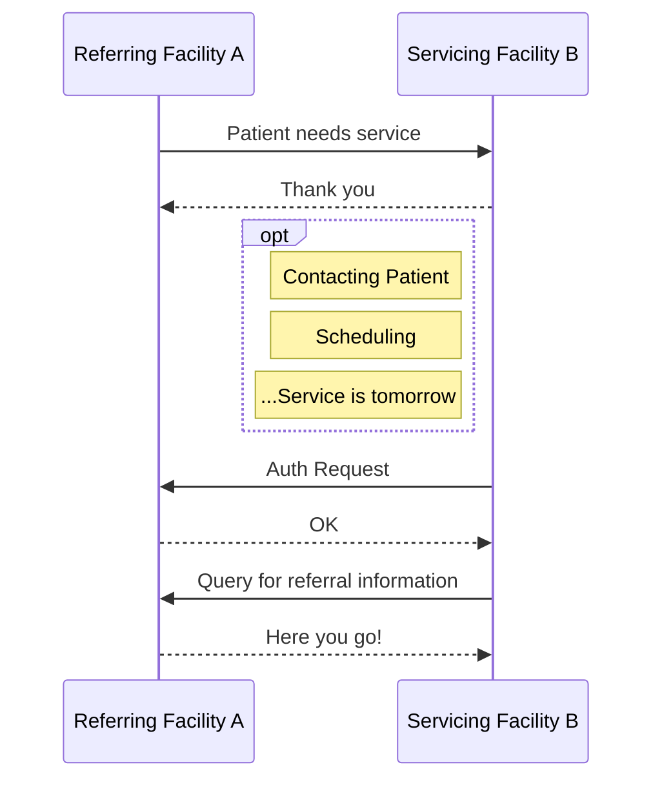

# FHIR Notified Pull

## History

A *very* quick and *hopefully* accurate history:
* Netherlands identifies need for closed-loop referrals
* Group in Netherlands began work on a [Technical Agreement for Notified Pull](https://www.twiin.nl/sites/default/files/content-files/TA%20Notified%20Pull_Concept.pdf)
* Nictiz inherited the project
* When Nictiz presented Notified Pull to FHIR-I for possible inclusion into core spec, discovered overlap with Subscriptions work
* Discussions around attempts to align
* You are here 😀
* Preference is to have content prepared for ballot in January (means hard deadline of late November)

> [name=Josh Mandel]What ballot / what project? The NIB deadline is coming up soon, but we can't have a NIB without a project + IG approved.
> [name=Gino Canessa]Depends on the selected choices - it will be either Subscriptions Backport, FHIR Core extensions pack, or both.  There are a few other changes in the backport IG regardless, so I may just file the NIB to be covered either way.

## Definitions / Assumptions

* Referring Organization
    * Organization that is producing and sending a notification
    * Knows the information that it will allow a servicing organzation to read
* Servicing Organization
    * Organization receiving a notification
    * Has network access but not general authorization to the referring organization

## Use Case

The initially-presented use case is around a referral workflow.  The scenario is that some facility (A) is sending a referral to another facility (B) for some sort of patient service.  While Facility A knows the information that Facility B needs, Facility A does not know *when* Facility B will be performing services.  If there is a time gap (e.g., services at Facility B are running six months out), it is better for Facility B to resolve information at the time of service instead of at the time of referral.



There were two issues identified with the FHIR Subscriptions Framework that need to be addressed:
* The originating facility cannot know ahead of time what the IDs are for resources
    * E.g., if new vital signs are taken between referral and service, the service provider needs to *query* not *read*.
    * See [Sending Queries](#sendingQueries)
* The notification needs security information that can be used to access the referral information
    * See [Sending Authorization](#sendingAuthorization)


## <a id="sendingQueries"></a>Sending Queries

During discussions, there are two main reasons for sending a query instead of an id/resource that have surfaced:
* time delay resulting in newer resources that did not exist when the notification was sent, and
* server-complexity in a query format resulting in non-standard queries.

For the first issue, a query *must* be performed by the client.  If this was the only concern, a client *should* be able to overcome by constructing their own queries for the data they need.  For example, if a referral is for a surgical procedure, it is assumed that the servicing facility  would be able to perform the 'standard' queries for things like vital signs, medication lists, etc..

However, some information is not well-standardized in *how* to ask for it.  One example is Insurance Coverage in a United States context.  A referring facility might know how to access that information for a patient, but the details can be vendor-specific, and sometimes even site-specific.  It is unreasonable to place that burden on the servicing facility.

In TA Notified Pull, the process described is tied to a `Task` resource, so the Referring Facility provides the Servicing Facility a Task with a list of `Task.input` elements describing queries to perform. Each input conveys two pieces of information:
* a `coding` representing the type of data that the query will provide (e.g., `http://loinc.org#8302-2` for a Body Height query, `http://snomed.info/sct#118246004` or `http://terminology.hl7.org/CodeSystem/observation-category#laboratory` for a Lab result query, etc.)
* a URL segment of an HTTP GET request to perform (e.g., `Observation/$lastn?code=http://loinc.org|8302-2`, `Observation?code=http://loinc.org|8302-2&_lastUpdated=ge2023&_sort=-_lastUpdated`, `Observation/$lastn?category=http://snomed.info/sct|118246004&_include=Observation:related-target&_include=Observation:specimen`)

In consideration for moving this type of flow into FHIR core, it was agreed that we should remove the dependency on sending `Task` resources between facilities.  Following are the current proposals, in no particular order.

Note that the 'Pros' and 'Cons' sections should be considered "work in progress" and will be updated frequently as discussions progress.

### <a id="option1"></a>Option 1: Named Query

Since the referring facility is responsible for pairing the coded type information and the acutal request URL, the URL is superfluous.  In order to facilitate the process, a named query can be defined that accepts the type information and returns the correct search results.

To continue with one of the above examples, assume we are communicating to a referral organization that they need current Lab Results for a patient before performing services.  In this particular jurisdiction, lab results are identified using the SNOMED code `118246004` (Laboratory test finding).

When sending a notification, the notification only needs to communicate the code to the client, e.g. by including a parameters resource in the notification bundle:
```json
{
    "fullUrl": "f5fc5e83-e640-4853-8269-a728195e42e1",
    "resource": {
        "resourceType": "Parameters",
        "id": "4abcd3c2-409b-4ebd-8fa9-7e2e1ac906bd",
        "parameter": [
            {
                "name": "query",
                "valueCoding": {
                    "system": "http://snomed.info/sct",
                    "code": "118246004",
                    "display": "Laboratory test finding"
                }
            }
        ]
    }
}
```

Additional queries add repetitions of the `query` parameter.

When the servicing organization wants to resolve the requests, they can be submitted as queries to the server:
* System-level op `?_query=search-by-code&code=http://snomed.info/sct|118246004`
* Patient compartment op `Patient/[id]?_query=search-by-code&code=http://snomed.info/sct|118246004`

#### Pros

* The named query can be defined in any version of FHIR
> [name=Josh Mandel]How is this a pro over "an arbitrary GET URL" which also works in any version of FHIR
> [name=Gino Canessa]The use case is for when there are implementation-specific URLs.  E.g., (example from WGM) the way you discover insurance coverage, which is not currently standardized.  The *best* outcome would be if all the queries became standardized prior to use in this type of scenario, but this is something that can be done in production without that.  Also, I noticed that (for example), many of the Notified Pull examples execute `$lastn` instead of a search - I *assume* the preference for those types of differences is server-specific.
* No additional definitions for Subscriptions Framework
* Useful outside of this context - complicated queries can be reduced by servers
> [name=Josh Mandel]This might also be a "con" -- it sounds like setting up custom RPCs where everyone needs to pre-coordinate on the "function names" (i.e., Codings that define behavior)
> [name=Gino Canessa]Fair point, included below.
* Clients can perform only the queries they want, based on understanding the coded information
* Results are intrinsically tied to the type information, since they are returned per request
* Allows servers to update queries/inclusions at their discretion

#### Cons

* Servers need to implement the named query
* Behavior of named query "competes with" existing server functionality
    * Defines multiple ways of getting querying for the same information

### <a id="option2"></a>Option 2: Operation of Notification

If the queries being performed are fixed according the notification, the notification itself could be used to perform the queries.

For example, if a servicing organzation has recevied a notification `123`, a request such as: `Subscription/ABC/$expandNotification?id=123` could perform all of the relevant searches and respond with the relevant data.  Results could either be returned as a single `searchset` bundle, or could be in something like a `batch` bundle containing an entry (`searchset`) for each request type.

#### Pros

* Definitions are simple
* Implementation is straightforward

#### Cons

* Ability to send 'pull requests' to another system is iied to the subscriptions framework
* Ability to resolve 'pull requests' to another system is iied to the subscriptions framework
* Clients get all or nothing (e.g., cannot ask for subsets)
* Need to either tag results or nest bundles to map results and request types

### <a id="option3"></a>Option 3: Including in Notifications

This option generally maps the closest to the current TA Notified Pull proposal.  It reduces to including the type and URL fragments in notifications.  However, there are a few ways *to* include that information, which are expanded below.  These options are equivalent to each other, with the differences being structural.

#### Pros

* Closest to TA Notified Pull pattern
* Reuses existing FHIR API semantics for data requests

#### Cons

* Ability to send 'pull requests' to another system is tied to subscriptions framework
> [name=Josh Mandel]Not really tied -- the REST API calls themselves are just "normal", as you'd have/use outside of Subscriptions. No new operations/queries.
> [name=Gino Canessa]Added clarification.
* Structures are generally nested/complicated

#### <a id="option3a"></a>Option 3a: Extension in SubscriptionStatus

This option is modeled differently in FHIR R4 and later versions, because the resources we need to add extensions to do not exist in R4.

##### FHIR R4

Since `SubscriptionStatus` is represented as a `Parameters` resource in FHIR R4, the additional information for queries would be additions to the allowed parameters.


For example:
```json
{
    "resourceType": "Parameters",
    "id": "292d3c72-edc1-4d8a-afaa-d85e19c7f563",
    "meta": {
        "profile": [
            "http://hl7.org/fhir/uv/subscriptions-backport/StructureDefinition/backport-subscription-status-r4"
        ]
    },
    "parameter": [
        {
            "name": "subscription",
            "valueReference": {
                "reference": "https://example.org/fhir/Subscription/admission"
            }
        },
        {
            "name": "topic",
            "valueCanonical": "http://hl7.org/SubscriptionTopic/admission"
        },
        {
            "name": "status",
            "valueCode": "active"
        },
        {
            "name": "type",
            "valueCode": "event-notification"
        },
        {
            "name": "events-since-subscription-start",
            "valueString": "2"
        },
        {
            "name": "notification-event",
            "part": [
                {
                    "name": "event-number",
                    "valueString": "2"
                },
                {
                    "name": "timestamp",
                    "valueInstant": "2020-05-29T11:44:13.1882432-05:00"
                },
                {
                    "name": "focus",
                    "valueReference": {
                        "reference": "https://example.org/fhir/Patient/1111"
                    }
                },
                {
                    "name": "related-query",
                    "part": [
                        {
                            "name": "query-type",
                            "valueCoding": {
                                "system": "http://snomed.info/sct",
                                "code": "118246004",
                                "display": "Laboratory test finding"
                            }
                        },
                        {
                            "name": "query",
                            "valueString": "Observation/$lastn?category=http://snomed.info/sct|118246004&_include=Observation:related-target&_include=Observation:specimen"
                        }
                    ]
                }
            ]
        }
    ]
}
```

Additional queries add repetitions of the `related-query` parameter part.

##### Later

Add a complex extension allowed on `SubscriptionStatus.notificationEvent` and `SubscriptionTopic.notificationShape`.  The extension has two properties, an optional `queryType` (Coding) and a required `query` (string).

For example:
```json
{
    "resourceType": "SubscriptionStatus",
    "id": "a323a801-4612-4e5f-bddf-7b49364e9d06",
    "status": "active",
    "type": "event-notification",
    "eventsSinceSubscriptionStart": "2",
    "notificationEvent": [
        {
            "eventNumber": "2",
            "timestamp": "2020-05-29T11:44:13.1882432-05:00",
            "focus": {
                "reference": "https://example.org/fhir/Patient/1111"
            },
            "extension": [
                {
                    "url": "http://hl7.org/fhir/uv/subscriptions-backport/StructureDefinition/notification-related-query"
                    "extension": [
                        {
                            "url": "queryType",
                            "valueCoding": {
                                "system": "http://snomed.info/sct",
                                "code": "118246004",
                                "display": "Laboratory test finding"
                            }
                        },
                        {
                            "url": "query",
                            "valueString": "Observation/$lastn?category=http://snomed.info/sct|118246004&_include=Observation:related-target&_include=Observation:specimen"
                        }
                    ]
                }
            ]
        }
    ],
    "subscription": {
        "reference": "https://example.org/fhir/Subscription/referrals-facility-b"
    },
    "topic": "http://hl7.org/SubscriptionTopic/referral-surgical"
}
```

Additional queries add repetitions of the `notification-related-query` extension on `notificationEvent`.

#### <a id="option3b"></a>Option 3b: Parameters Resource

In this option, the queries are added as a distinct `Parameters` resource as part of the notification.  This could either be the `focus` or `additionalContext`.  This is similar to how notifications are adding in FHIR R4 according to option 3a, but more consistent across versions by using a separate `Parameters` resource.  The structure is a shallower, since mapping queries to events is done by referencing the appropriate resource in the bundle instead of within a single nested instance.

```json
{
    "resourceType": "Parameters",
    "id": "38301aa6-c999-46a3-bb37-48881ba29158",
    "parameter": [
        {
            "name": "related-query",
            "part": [
                {
                    "name": "query-type",
                    "valueCoding": {
                        "system": "http://snomed.info/sct",
                        "code": "118246004",
                        "display": "Laboratory test finding"
                    }
                },
                {
                    "name": "query",
                    "valueString": "Observation/$lastn?category=http://snomed.info/sct|118246004&_include=Observation:related-target&_include=Observation:specimen"
                }
            ]
        }
    ]
}
```

Additional queries add additional repetitions of the `related-query` parameter.

#### <a id="option3c"></a>Option 3c: Batch Bundle

In this option, the queries are added into a `Bundle` resource as part of the notification.  The resource is a `batch` bundle, which can be submitted back to the referring organization to be executed directly, or can be processed by a servicing organization in order to separate out individual queries.  The resource could either be the `focus` or `additionalContext` of a notification event.  In order to facilitate mapping between the queries and the coded type information, a new extension would need to be defined on `Bundle.entry`.  I believe that extension would be a candidate for the core FHIR extensions instead of living in the subscriptions space.

```json
{
    "resourceType": "Bundle",
    "id": "482c5d32-01d9-4bba-9814-0b1847ab2464",
    "type": "batch",
    "entry": [
        {
            "request": {
                "method": "GET",
                "url": "Observation/$lastn?category=http://snomed.info/sct|118246004&_include=Observation:related-target&_include=Observation:specimen"
            },
            "extension": {
                "url": "http://hl7.org/fhir/StructureDefinition/bundleEntryType",
                "valueCoding": {
                    "system": "http://snomed.info/sct",
                    "code": "118246004",
                    "display": "Laboratory test finding"
                }
            }
        }
    ]
}
```

Additional queries add additional `entry` records to the bundle.

##### Pros

* Reuse existing bundle mechanics for searching
* Allows for different HTTP methods

##### Cons

* Notifications contain nested bundles

#### <a id="option3d"></a>Option 3d: FHIR R4 Bundle Hybrid

Because our primary focus right now is in FHIR R4, we can take advantage of using `history` bundles in FHIR R4.  Specifically, we can add additional `entry` records with the `request` filled out without nesting bundles.

This option results in the same entries as [Option 3c](#option3c), but does not nest the bundles.  It requires the same extension definition in order to map types and requests.

##### Pros

* Avoids nesting bundles

##### Cons

* Need to define alternative for FHIR R5 - can make the modifications to `Bundle` in FHIR R6


## <a id="sendingAuthorization"></a>Sending Authorization

In the TA Notified Pull document, authorization is sent by including an `authorization_base` token along with the notification.  The token is used during an OAuth workflow and is exchanged (along with other data, including a client authentication token) for an access token.

There are many possible ways of providing authorization information, and I believe we do not yet have enough implementation experience to restrict to a single form.  In light of that, I propose adding a generic mechanism that can be used to provide authorization information alongside a notification.

Specifically, I believe that notifications should have some sort of key-value pair, though I am ambivalent on whether the key should be free text (`string`) or coded information (`coding`).  Given that coded information is strictly easier to work with, I am defaulting to that.

Note that this attempts to consolidate work in other IGs.

I am proposing an extension on `SubscriptionStatus.notificationEvent` that provides authorization information in two parts: a `type` and a `value`.  For example, in FHIR R4B and R5:

```json
{
    "resourceType": "SubscriptionStatus",
    ...
    "notificationEvent": [
        {
            ...
            "extension": [
                {
                    "url": "http://hl7.org/fhir/StructureDefinition/authorization-hint"
                    "extension": [
                        {
                            "url": "type",
                            "valueCoding": {
                                "system": "http://fhir.nl/fhir/NamingSystem/TaskParameter",
                                "code": "authorization-base",
                                "display": "NL OAuth request token"
                            }
                        },
                        {
                            "url": "value",
                            "valueString": "ZGFhNDFjY2MtZGFmMi00YjZkLThiNDYtN2JlZDk1MWEyYzk2"
                        }
                    ]
                }
            ]
        }
    ],
    ...
}
```

In FHIR R4, I believe it is cleanest to include authorization information in the `Parameters` resource used for status information (instead of layering an extension onto `Parameters.parameter`):
```json
{
    "resourceType": "Parameters",
    ...
    "parameter": [
        {
            "name": "subscription",
            "valueReference": {
                "reference": "https://example.org/fhir/Subscription/admission"
            }
        },
        ...
        {
            "name": "notification-event",
            "part": [
                {
                    "name": "event-number",
                    "valueString": "2"
                },
                ...
                {
                    "name": "authorization-hint",
                    "part": [
                        {
                            "name": "type",
                            "valueCoding": {
                                "system": "http://fhir.nl/fhir/NamingSystem/TaskParameter",
                                "code": "authorization-base",
                                "display": "NL OAuth request token"
                            }
                        },
                        {
                            "url": "value",
                            "valueString": "ZGFhNDFjY2MtZGFmMi00YjZkLThiNDYtN2JlZDk1MWEyYzk2"
                        }
                    ]
                }
            ]
        }
    ]
}

```


Note that the extension context needs to be expanded to cover use cases in other IGs - specifically `Endpoint` / `reference(Endpoint)` and `Organization` have been documented.