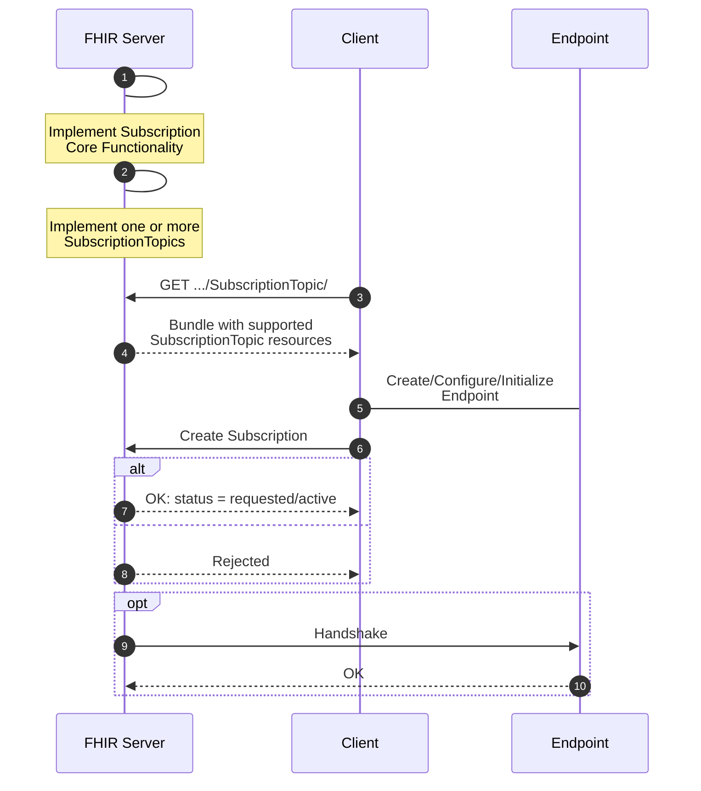

```mermaid
sequenceDiagram
  autonumber
  participant S as FHIR Server
  participant C as Client
  participant E as Endpoint

  S->S: 
  Note over S: Implement Subscription<br/>Core Functionality

  S->S: 
  Note over S: Implement one or more<br/>SubscriptionTopics

  C->>S: GET .../SubscriptionTopic/
  S-->>C: Bundle with supported<br/>SubscriptionTopic resources

  C->E: Create/Configure/Initialize<br/>Endpoint
  
  C->>S: Create Subscription
  alt
    S-->>C: OK: status = requested/active
  else 
    S-->>C: Rejected
  end

  opt
    S->>E: Handshake
    E-->>S: OK
  end
```
