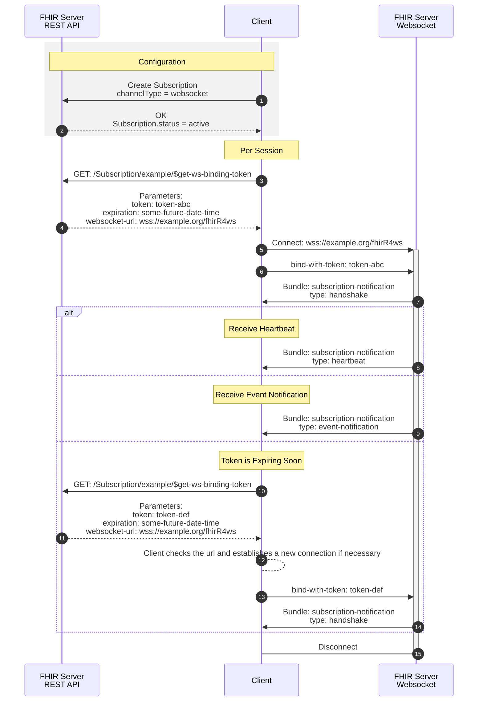
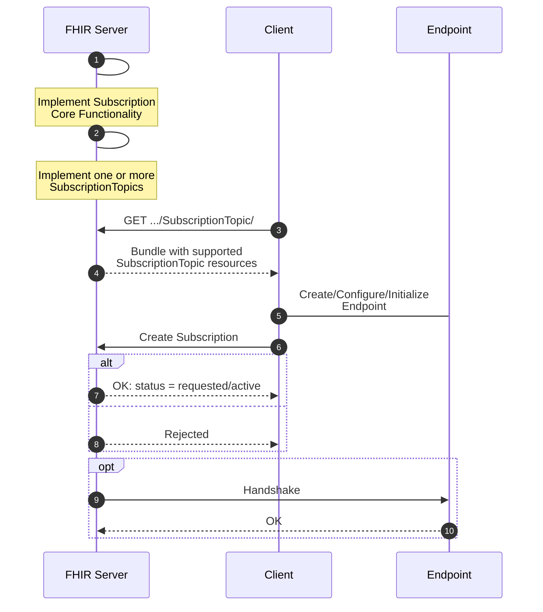

```mermaid
sequenceDiagram
  autonumber
  participant S as FHIR Server<br/>REST API
  participant C as Client
  participant E as FHIR Server<br/>Websocket


  rect rgba(0,0,0,.05)
    note over C,S: Configuration
    C->>S: Create Subscription<br/>channelType = websocket
    S-->>C: OK<br/>Subscription.status = active
  end

note over C: Per Session
C->>S: GET: /Subscription/example/$get-ws-binding-token
S-->>C: Parameters:<br/>token: token-abc<br/>expiration: some-future-date-time<br/>websocket-url: wss://example.org/fhirR4ws
C->>+E: Connect: wss://example.org/fhirR4ws

C->>E: bind-with-token: token-abc
E->>C: Bundle: subscription-notification<br/>type: handshake


alt 
    note over C: Receive Heartbeat
    E->>C: Bundle: subscription-notification<br/>type: heartbeat
else
    note over C: Receive Event Notification
    E->>C: Bundle: subscription-notification<br/>type: event-notification
else
    note over C: Token is Expiring Soon
    C->>S: GET: /Subscription/example/$get-ws-binding-token
    S-->>C: Parameters:<br/>token: token-def<br/>expiration: some-future-date-time<br/>websocket-url: wss://example.org/fhirR4ws
    C-->C: Client checks the url and establishes a new connection if necessary
    C->>E: bind-with-token: token-def
    E->>C: Bundle: subscription-notification<br/>type: handshake
end

E->-C: Disconnect
```

  C->>S: GET: /metadata
  S-->>C: Capability Statement including Extension: websocket

```mermaid
sequenceDiagram
  autonumber
  participant S as FHIR Server
  participant C as Client
  participant E as Endpoint

  S->S: 
  Note over S: Implement Subscription<br/>Core Functionality

  S->S: 
  Note over S: Implement one or more<br/>SubscriptionTopics

  C->>S: GET .../SubscriptionTopic/
  S-->>C: Bundle with supported<br/>SubscriptionTopic resources

  C->E: Create/Configure/Initialize<br/>Endpoint
  
  C->>S: Create Subscription
  alt
    S-->>C: OK: status = requested/active
  else 
    S-->>C: Rejected
  end

  opt
    S->>E: Handshake
    E-->>S: OK
  end
```
